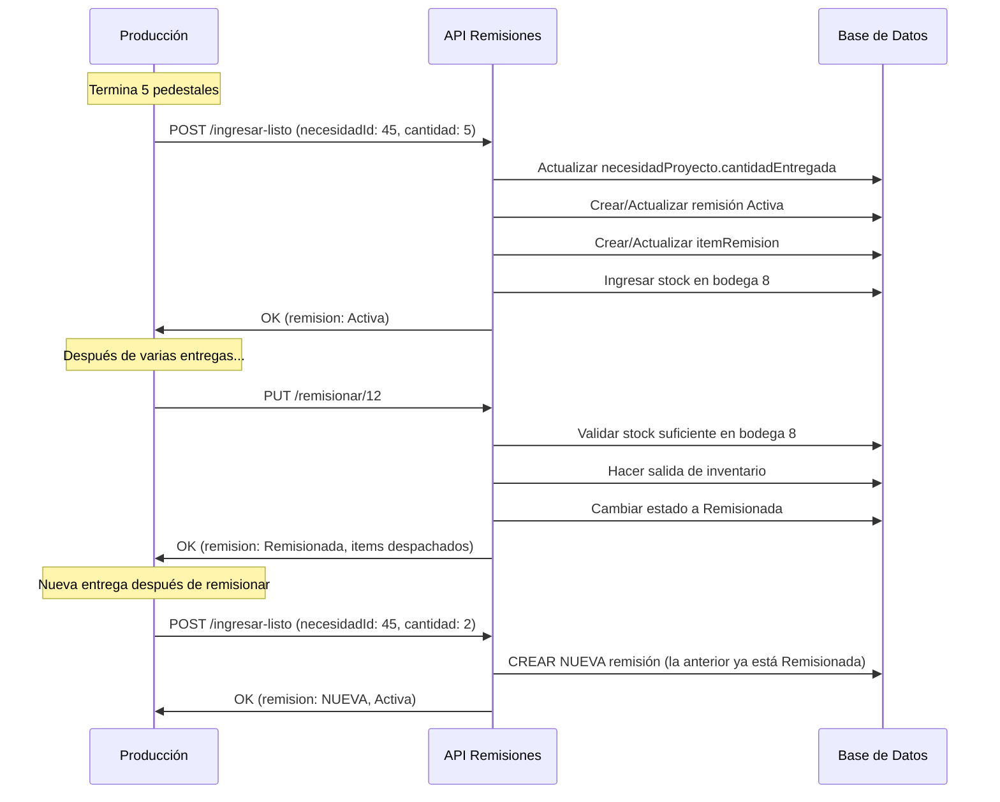

# 📡 API de Remisiones - Resumen de Endpoints

## Base URL
```
http://localhost:3000/api/remision
```

---

## 📝 Endpoints Disponibles

### 1️⃣ Ingresar Cantidades Listas

**POST** `/post/ingresar-listo`

Ingresa cantidades listas desde producción hacia bodega 8 (Listo) y las registra en una remisión.

**Body:**
```json
{
  "necesidadProyectoId": 45,
  "cantidad": 5.5,
  "medida": "1.2X2.4",
  "notas": "Primera entrega"
}
```

**Respuesta (201):**
```json
{
  "ok": true,
  "necesidadProyecto": { ... },
  "remision": { ... },
  "itemRemision": { ... },
  "stock": { ... }
}
```

**Funcionalidad:**
- ✅ Actualiza `necesidadProyecto.cantidadEntregada`
- ✅ Actualiza `necesidadProyecto.estado` (reservado/parcial/completo)
- ✅ Crea o usa remisión Activa existente
- ✅ Crea o actualiza (sumando) `itemRemision`
- ✅ Ingresa stock en bodega 8
- ✅ Registra `stockMove` tipo `INGRESO_LISTO`

**Validaciones:**
- ❌ No se puede entregar más de lo comprometido
- ❌ cantidad debe ser > 0
- ❌ necesidadProyectoId debe existir

---

### 2️⃣ Remisionar Documento

**PUT** `/put/remisionar/:remisionId`

Cambia el estado de la remisión a "Remisionada" y hace salida de inventario.

**Params:**
- `remisionId`: ID de la remisión

**Respuesta (200):**
```json
{
  "ok": true,
  "remision": {
    "id": 12,
    "numeroRemision": "REM-REQ001-1645678900000",
    "estado": "Remisionada",
    "fechaRemision": "2026-02-19T10:30:00.000Z"
  },
  "itemsRemisionados": [ ... ],
  "totalItems": 2
}
```

**Funcionalidad:**
- ✅ Valida stock suficiente en bodega 8
- ✅ Hace salida de inventario (descuenta de stock)
- ✅ Cambia `remision.estado` a "Remisionada"
- ✅ Actualiza `remision.fechaRemision`
- ✅ Cambia `itemRemision.estado` a "Remisionado"
- ✅ Registra `stockMove` tipo `SALIDA_REMISION`

**Validaciones:**
- ❌ Remisión debe existir
- ❌ Remisión debe estar en estado "Activa"
- ❌ Debe haber stock suficiente en bodega 8 para TODOS los items
- ❌ Si falta stock → ROLLBACK completo

---

### 3️⃣ Obtener Remisiones de una Requisición

**GET** `/get/requisicion/:requisicionId`

Obtiene todas las remisiones de una requisición específica.

**Params:**
- `requisicionId`: ID de la requisición

**Respuesta (200):**
```json
{
  "ok": true,
  "requisicionId": 5,
  "totalRemisiones": 2,
  "remisiones": [
    {
      "id": 12,
      "numeroRemision": "REM-REQ001-1645678900000",
      "estado": "Remisionada",
      "fechaRemision": "2026-02-19T10:30:00.000Z",
      "requisicion": { "id": 5, "folio": "REQ001" },
      "itemRemisions": [
        {
          "id": 34,
          "cantidad": 8.5,
          "estado": "Remisionado",
          "producto": { "id": 10, "item": "Pedestal" },
          "necesidadProyecto": { ... }
        }
      ]
    }
  ]
}
```

**Funcionalidad:**
- ✅ Lista todas las remisiones (Activas y Remisionadas)
- ✅ Incluye items con detalles de productos/kits
- ✅ Incluye información de necesidadProyecto
- ✅ Ordenadas por fecha de creación (DESC)

---

### 4️⃣ Obtener Detalle de una Remisión

**GET** `/get/:remisionId`

Obtiene el detalle completo de una remisión específica.

**Params:**
- `remisionId`: ID de la remisión

**Respuesta (200):**
```json
{
  "ok": true,
  "remision": {
    "id": 12,
    "numeroRemision": "REM-REQ001-1645678900000",
    "estado": "Remisionada",
    "fechaRemision": "2026-02-19T10:30:00.000Z",
    "observaciones": "...",
    "requisicion": { "id": 5, "folio": "REQ001" },
    "itemRemisions": [
      {
        "id": 34,
        "cantidad": 8.5,
        "medida": "1.2X2.4",
        "estado": "Remisionado",
        "notas": "...",
        "producto": { "id": 10, "item": "Pedestal", "unidad": "unidad" },
        "kit": null,
        "necesidadProyecto": {
          "id": 45,
          "cantidadComprometida": 10,
          "cantidadEntregada": 8.5,
          "estado": "parcial"
        }
      }
    ]
  }
}
```

**Funcionalidad:**
- ✅ Detalle completo de la remisión
- ✅ Todos los items incluidos
- ✅ Información de productos/kits
- ✅ Estado de necesidadesProyecto

---

## 🔗 Ejemplos con cURL

### Ingresar cantidades listas
```bash
curl -X POST http://localhost:3000/api/remision/post/ingresar-listo \
  -H "Content-Type: application/json" \
  -d '{
    "necesidadProyectoId": 45,
    "cantidad": 5.5,
    "notas": "Primera entrega de pedestales"
  }'
```

### Remisionar
```bash
curl -X PUT http://localhost:3000/api/remision/put/remisionar/12
```

### Obtener remisiones de requisición
```bash
curl -X GET http://localhost:3000/api/remision/get/requisicion/5
```

### Obtener detalle de remisión
```bash
curl -X GET http://localhost:3000/api/remision/get/12
```

---

## 🎯 Flujo Típico de Uso



---

## ⚠️ Errores Comunes

### 400 - No se puede entregar más de lo comprometido
```json
{
  "ok": false,
  "msg": "No se puede entregar más de lo comprometido. Comprometido: 10, Ya entregado: 8, Intentas agregar: 5, Nuevo total: 13"
}
```

### 400 - Stock insuficiente
```json
{
  "ok": false,
  "msg": "Stock insuficiente en bodega 8 para Pedestal Ejecutivo. Disponible: 5, Necesario: 10"
}
```

### 400 - Remisión no está Activa
```json
{
  "ok": false,
  "msg": "La remisión REM-REQ001-xxx no está Activa (estado actual: Remisionada)"
}
```

### 404 - Remisión no encontrada
```json
{
  "ok": false,
  "msg": "Remisión con ID 999 no encontrada"
}
```

---

## 🔒 Reglas de Negocio

1. **Una sola remisión Activa por requisición**  
   Si ya existe una remisión Activa, se usa esa. No se crean duplicados.

2. **No exceder lo comprometido**  
   La suma de `cantidadEntregada` nunca puede superar `cantidadComprometida`.

3. **Acumulación de cantidades**  
   Si un item ya existe en la remisión Activa, se SUMA la nueva cantidad.

4. **Validación de stock al remisionar**  
   Se valida que TODOS los items tengan stock suficiente antes de hacer cualquier descuento.

5. **Transaccionalidad total**  
   Si algo falla, se hace ROLLBACK completo. No hay cambios parciales.

6. **Remisión cerrada no se reutiliza**  
   Una vez "Remisionada", no se puede agregar más items. Se debe crear una nueva.

---

## 📊 Estados y Transiciones

### Estado `necesidadProyecto`
```
reservado → parcial → completo
(0%)      (0-99%)    (100%)
```

### Estado `remision`
```
Activa → Remisionada
(editable) (cerrada)
```

### Estado `itemRemision`
```
Pendiente → Remisionado
```

---

**Autor:** API de Remisiones  
**Versión:** 1.0  
**Última actualización:** 2026-02-19
